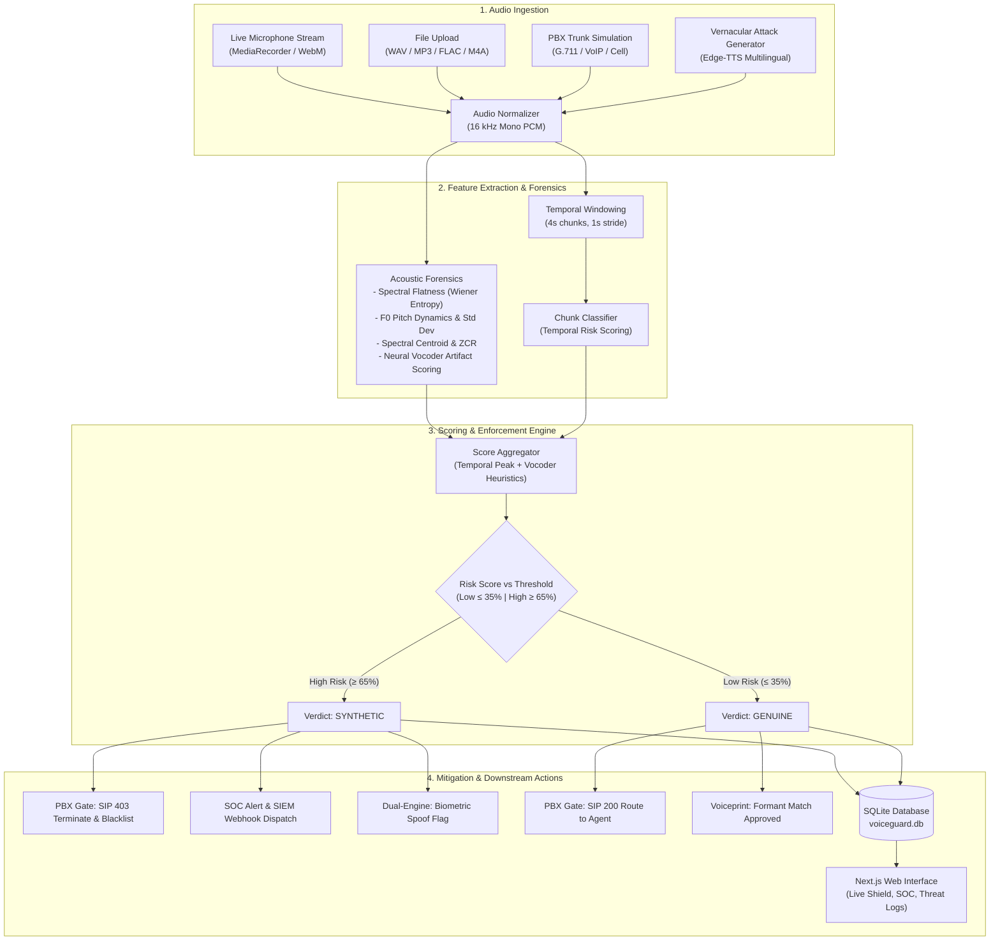

# VoiceGuard AI

> **Real-Time AI Voice Cloning and Synthetic Speech Detection Engine for Enterprise Fraud Prevention**  
> *Built for SIH Hackathon 2026*

[](https://fastapi.tiangolo.com)
[](https://nextjs.org)
[](https://www.typescriptlang.org)
[](https://www.python.org)
[](https://tailwindcss.com)
[](https://www.docker.com)

---

## Table of Contents

- [Problem Statement](#problem-statement)
- [Key Features](#key-features)
- [System Architecture](#system-architecture)
- [Tech Stack](#tech-stack)
- [Project Structure](#project-structure)
- [Getting Started](#getting-started)
  - [Prerequisites](#prerequisites)
  - [Backend Setup](#backend-setup)
  - [Frontend Setup](#frontend-setup)
  - [Running with Docker Compose](#running-with-docker-compose)
  - [Environment Configuration](#environment-configuration)
- [Usage Walkthrough](#usage-walkthrough)
- [API Reference](#api-reference)
- [Team & Credits](#team--credits)
- [License](#license)

---

## Problem Statement

Modern generative voice cloning models can synthesize convincing replicas of a human voice using merely seconds of reference audio. Cybercriminals exploit this technology to execute high-impact fraud schemes—including executive wire fraud (CEO impersonation), IT service desk credential resets, and digital arrest extortion scams across banking and enterprise communication channels. Traditional security controls rely on caller ID metadata and out-of-band passwords, providing zero defense against real-time voice spoofing during active audio streams.

**VoiceGuard AI** addresses this threat by performing low-latency, temporal sliding-window acoustic forensics and neural vocoder artifact detection. It inspects both live telephone/VoIP audio streams and uploaded recordings, providing sub-second risk scoring, automated PBX call termination, and forensic audit trails before fraudulent transactions can be authorized.

---

## Key Features

- **Live Shield (Real-Time Stream Interceptor)**: Ingests streaming audio chunks directly from browser microphone input or telephony sessions, rendering continuous sliding-window risk scores and instant synthetic voice alerts.
- **File Inspector (Forensic Audio Analyzer)**: Deep static analysis for `.wav`, `.mp3`, `.m4a`, `.ogg`, and `.flac` files, providing temporal chunk-by-chunk heatmaps, acoustic feature distributions, and cryptographic SHA-256 integrity hashing.
- **Dual-Engine Voiceprint Verification**: Combines biometric acoustic resonance embeddings across 8 anatomical vocal tract formant frequency bands with anti-spoof liveness verification to distinguish authentic authorized personnel from AI voice clones.
- **Vernacular Defense (Indian Regional Languages)**: Detection coverage across regional Indian language attack vectors (Hindi, Tamil, Telugu, and code-switched Hinglish), featuring on-demand edge-tts synthesis for zero-day extortion simulation.
- **Adversarial Perturbation & Denoising**: Resilience evaluation against adversarial evasion techniques (additive environmental noise and tempo/cadence stretching), equipped with an adaptive STFT spectral subtraction denoiser that isolates underlying vocoder phase anomalies.
- **Telephony Codec Degradation Benchmark**: Stress-tests audio resilience across four telecom transmission profiles: Studio HD (16 kHz PCM), Wideband VoIP (Opus / AMR-WB), PSTN Landline (ITU-T G.711 $\mu$-law 8 kHz), and Lossy Cellular with micro-packet dropouts.
- **War Room (PBX Telephony Gateway Simulation)**: Enterprise switchboard simulator modeling active trunks (Corporate Treasury, IT Service Desk, Executive Line) with automated SIP response routing (`SIP 200 OK` Route to Agent, `SIP 302` Divert to Vocal OTP IVR, `SIP 403` Terminate & Blacklist).
- **SOC Incident Command Center**: Enterprise cyber incident management dashboard tracking attack vectors, neural vocoder signatures (HiFi-GAN, WaveNet, MelGAN, Diffusion), incident lifecycle states (`OPEN`, `INVESTIGATING`, `CONTAINED`, `FALSE_POSITIVE`), and SIEM webhook dispatches.
- **Threat Intelligence & Global Telemetry**: Interactive radar monitoring financial fraud corridors (e.g., Mumbai, Bengaluru, New York), tracking averted financial loss metrics and live intercept feeds.
- **Acoustic Watermarking Studio**: Embeds and verifies imperceptible high-frequency spread-spectrum acoustic signatures (7.3 kHz – 7.7 kHz) for tamper-proof corporate audio provenance certification.
- **Configurable Security Policies**: Adjustable operational tiers (Permissive, Standard, Strict/Banking) with configurable low/high risk thresholds (default: 35% / 65%) and automated enforcement triggers.
- **Audit Logs & Exportable Dossiers**: Persistent SQLite database storing full inspection histories, temporal chunk scores, and forensic acoustic breakdowns with exportable incident dossiers.
- **Developer API & Playground**: OpenAPI Swagger documentation with executable Python and cURL snippets for third-party SIEM/PBX integrations.

---

## System Architecture



---

## Tech Stack

### Frontend
- **Framework**: [Next.js 16](https://nextjs.org/) (App Router, Turbopack)
- **UI Library**: [React 19](https://react.dev/)
- **Language**: [TypeScript 5](https://www.typescriptlang.org/)
- **Styling**: [Tailwind CSS v4](https://tailwindcss.com/)
- **Icons & Visuals**: [Lucide React](https://lucide.dev/), [Recharts](https://recharts.org/)

### Backend
- **Framework**: [FastAPI](https://fastapi.tiangolo.com/) (Asynchronous REST API)
- **ASGI Server**: [Uvicorn](https://www.uvicorn.org/) (with WatchFiles reloader)
- **Language**: [Python 3.11+](https://www.python.org/)
- **Data Validation & Settings**: [Pydantic v2](https://docs.pydantic.dev/) & [Pydantic Settings](https://docs.pydantic.dev/latest/concepts/pydantic_settings/)
- **Database ORM**: [SQLAlchemy 2.0](https://www.sqlalchemy.org/) with SQLite

### Machine Learning, Signal Processing & Speech
- **Detection Architecture**: Model integration configured for `garystafford/wav2vec2-deepfake-voice-detector` ([Hugging Face Transformers](https://huggingface.co/transformers) / PyTorch / TorchAudio).
- **Acoustic Forensic Engine**: Multi-metric spectral analysis using Wiener entropy (spectral flatness), autocorrelation fundamental frequency ($F_0$) pitch tracking, prosodic pitch variation ($\sigma_{F0}$), spectral centroid, and zero-crossing rate.
- **Audio Processing Libraries**: `scipy.signal` (STFT/ISTFT, Butterworth filters, resampling, logarithmic $\mu$-law companding), `numpy`, `soundfile`, `librosa`.
- **Speech Synthesis (Simulation Tools)**: `edge-tts` (Microsoft Edge neural speech synthesis used to generate Indian regional test voices).

---

## Project Structure

```text
voiceguard-ai/
├── docker-compose.yml              # Multi-container orchestration (frontend + backend)
├── backend/
│   ├── Dockerfile                  # Backend container specification
│   ├── requirements.txt            # Python dependencies (FastAPI, PyTorch, SciPy, etc.)
│   ├── migrate.py                  # Database schema migration script
│   ├── voiceguard.db               # SQLite database file
│   ├── samples/                    # Preloaded genuine & synthetic audio test samples
│   ├── test_e2e.py                 # End-to-end API test suite
│   ├── test_phase3.py - test_phase8.py # Test verification suites for platform features
│   └── app/
│       ├── main.py                 # FastAPI application entry point, CORS & router mounts
│       ├── config.py               # Global settings, thresholds & model configurations
│       ├── db/
│       │   └── session.py          # SQLAlchemy engine, session maker & Base model
│       ├── models/
│       │   ├── scan.py             # ScanRecord ORM model (incidents, chunks, features)
│       │   └── speaker.py          # SpeakerProfile ORM model (biometric voiceprints)
│       ├── schemas/
│       │   ├── scan.py             # Pydantic schemas for scans, chunks & features
│       │   ├── soc.py              # Pydantic schemas for SOC telemetry & triage
│       │   └── speaker.py          # Pydantic schemas for dual-engine speaker auth
│       ├── routers/
│       │   ├── health.py           # Health check endpoint (/api/health)
│       │   ├── analyze.py          # File upload & live chunk analysis endpoints
│       │   ├── history.py          # Threat logs, filtering & scan deletion
│       │   ├── samples.py          # Preloaded sample catalog & on-demand execution
│       │   ├── speakers.py         # Biometric speaker enrollment & dual-engine verify
│       │   ├── soc.py              # SOC analytics, incident status & SIEM triage
│       │   ├── telephony.py        # PBX switchboard simulation & codec benchmarks
│       │   ├── threat_intel.py     # Global telemetry, radar hubs & feed
│       │   ├── multilingual.py     # Vernacular Indian language attack generation
│       │   └── settings.py         # Dynamic thresholds & watermark embed/verify
│       └── utils/
│           ├── audio_processor.py  # Audio decoding, resampling & chunk segmentation
│           ├── classifier.py       # Scoring pipeline, aggregation & verdict logic
│           ├── forensics.py        # STFT, pitch F0, spectral flatness & vocoder metrics
│           ├── voiceprint.py       # 8-band formant resonance extraction & comparison
│           ├── codec_simulator.py  # G.711, Opus, and lossy cell telecom simulation
│           ├── adversarial.py      # Noise injection, tempo stretching & STFT denoiser
│           └── watermark.py        # Inaudible spread-spectrum pilot tone watermark
└── frontend/
    ├── Dockerfile                  # Frontend container specification
    ├── package.json                # Next.js scripts & dependencies
    ├── tsconfig.json               # TypeScript configuration
    ├── next.config.ts              # Next.js configuration
    └── src/
        ├── app/                    # Next.js App Router pages
        │   ├── page.tsx            # Executive Dashboard & System Overview
        │   ├── live/               # Live Shield real-time microphone interceptor
        │   ├── upload/             # File Inspector forensic analysis studio
        │   ├── history/            # Threat Logs & exportable incident dossiers
        │   ├── demo-lab/           # Pre-configured attack simulation lab
        │   ├── voiceprint/         # Biometric speaker enrollment & dual verification
        │   ├── multilingual/       # Vernacular Indian language defense studio
        │   ├── adversarial/        # Adversarial noise & time-stretch stress lab
        │   ├── benchmark/          # Telephony codec degradation benchmark
        │   ├── war-room/           # PBX switchboard & automated SIP routing
        │   ├── soc/                # Enterprise SOC Command Center
        │   ├── threat-intel/       # Geospatial threat radar & live intercept feed
        │   ├── settings/           # Policy thresholds & acoustic watermark studio
        │   ├── developer/          # Developer API documentation & code playground
        │   └── about/              # Forensic acoustic science & methodology specs
        ├── components/             # Reusable UI components (Navbar, Spectrogram, etc.)
        └── lib/
            ├── api.ts              # Strongly typed fetch client for backend endpoints
            └── types.ts            # TypeScript interfaces matching backend schemas
```

---

## Getting Started

### Prerequisites

- **Python**: Version 3.11 or higher
- **Node.js**: Version 18.x or higher (tested with Node v22.15.x and npm 11.x)
- **Git**: For cloning the repository
- *(Optional)* **Docker & Docker Compose**: For containerized deployment

---

### Backend Setup

1. **Navigate to the backend directory**:
   ```bash
   cd backend
   ```

2. **Create and activate a virtual environment**:
   - On Windows (PowerShell):
     ```powershell
     python -m venv venv
     .\venv\Scripts\Activate.ps1
     ```
   - On Linux / macOS:
     ```bash
     python3 -m venv venv
     source venv/bin/activate
     ```

3. **Install dependencies**:
   ```bash
   pip install -r requirements.txt
   ```
   *(Note: On systems with managed Python environments, add `--break-system-packages` if installing globally).*

4. **Verify database tables and migrations**:
   ```bash
   python migrate.py
   ```

5. **Start the FastAPI backend development server**:
   ```bash
   python -m uvicorn app.main:app --host 127.0.0.1 --port 8001 --reload
   ```

6. **Verify backend status**:
   Open [http://127.0.0.1:8001/api/health](http://127.0.0.1:8001/api/health) in your browser. You should receive:
   ```json
   {
     "status": "ok",
     "service": "VoiceGuard AI",
     "version": "1.0.0"
   }
   ```

---

### Frontend Setup

1. **Navigate to the frontend directory** (in a new terminal):
   ```bash
   cd frontend
   ```

2. **Install Node.js packages**:
   ```bash
   npm install
   ```

3. **Configure environment variables**:
   Create or verify `frontend/.env.local`:
   ```env
   NEXT_PUBLIC_API_URL=http://localhost:8001
   ```

4. **Start the Next.js development server**:
   ```bash
   npm run dev
   ```

5. **Access the application**:
   Open [http://localhost:3000](http://localhost:3000) in your browser.

---

### Running with Docker Compose

To launch both frontend and backend in isolated containers:

```bash
docker compose up --build
```

- **Frontend**: [http://localhost:3000](http://localhost:3000)
- **Backend API**: [http://localhost:8001](http://localhost:8001)
- **Swagger Documentation**: [http://localhost:8001/docs](http://localhost:8001/docs)

---

### Environment Configuration

The backend reads configuration settings with safe defaults from `app/config.py`. You can override them via a `.env` file in the `backend/` directory:

| Variable | Default Value | Description |
| :--- | :--- | :--- |
| `HOST` | `127.0.0.1` | Host address for Uvicorn server |
| `PORT` | `8001` | Listening port for backend API |
| `DATABASE_URL` | `sqlite:///./voiceguard.db` | SQLAlchemy database connection URI |
| `LOW_RISK_THRESHOLD` | `35.0` | Scores $\le 35.0$ classified as genuine human voice |
| `HIGH_RISK_THRESHOLD` | `65.0` | Scores $\ge 65.0$ classified as synthetic AI voice |
| `MAX_FILE_SIZE_MB` | `25` | Maximum upload size for static audio files |
| `SAMPLE_RATE` | `16000` | Target uniform audio sampling rate (16 kHz) |

For the frontend, the following variable in `frontend/.env.local` controls backend communication:

| Variable | Default Value | Description |
| :--- | :--- | :--- |
| `NEXT_PUBLIC_API_URL` | `http://localhost:8001` | Base URL of the running VoiceGuard FastAPI backend |

---

## Usage Walkthrough

1. **Forensic File Inspection (`/upload`)**:
   - Go to **File Inspector** from the navigation bar.
   - Upload any audio recording or select one of the built-in scenario samples (e.g., *CEO Wire Fraud Clone* or *Authentic Executive Call*).
   - Review the aggregate risk score, the timeline of scored temporal chunks, acoustic metrics (spectral flatness, pitch standard deviation), and recommended mitigation actions.

2. **Live Call Interception (`/live`)**:
   - Go to **Live Shield**.
   - Click **Start Live Monitoring** and grant browser microphone permission.
   - Speak naturally or play external audio; the system transmits 3-second streaming chunks to the backend, rendering a real-time risk speedometer and dynamic alert banners.

3. **Threat Logs & Audit Trail (`/history`)**:
   - Navigate to **Threat Logs** to review a historical timeline of all scans.
   - Filter scans by `All`, `Synthetic`, or `Genuine`.
   - Click into any record to view SHA-256 integrity hashes, acoustic parameters, or export a formatted security incident dossier.

4. **Security Operations & War Room (`/soc` & `/war-room`)**:
   - Access **SOC Center** to monitor real-time incident queues, analyze vocoder distributions, and transition incident states.
   - Open **War Room** to simulate inbound calls to enterprise PBX extensions and test automated SIP enforcement policies (`SIP 403` vs. `SIP 200`).

---

## API Reference

Interactive API documentation and schema explorers are accessible when the backend is running:
- **Swagger UI**: [http://127.0.0.1:8001/docs](http://127.0.0.1:8001/docs)
- **ReDoc**: [http://127.0.0.1:8001/redoc](http://127.0.0.1:8001/redoc)

### Key Endpoints

| Method | Endpoint | Description |
| :--- | :--- | :--- |
| `GET` | `/api/health` | Service health status, active thresholds, and configured model. |
| `POST` | `/api/analyze/file` | Accepts a multipart audio file upload; returns full forensic analysis and saves to audit history. |
| `POST` | `/api/analyze/live-chunk` | Accepts real-time audio chunk blobs from microphone streams with sliding-window evaluation. |
| `GET` | `/api/history` | Retrieves paginated scan history with optional filtering by verdict (`genuine`/`synthetic`). |
| `GET` | `/api/speakers` | Lists enrolled personnel profiles with acoustic baseline parameters. |
| `POST` | `/api/speakers/enroll` | Enrolls a personnel voice baseline from an audio sample across 8 resonance frequency bands. |
| `POST` | `/api/speakers/verify` | Dual-engine authentication testing biometric voiceprint similarity alongside anti-spoof liveness. |
| `POST` | `/api/telephony/simulate-call` | Evaluates inbound PBX calls against active trunk lines and returns automated SIP routing decisions. |
| `POST` | `/api/telephony/benchmark/run` | Runs a 4-channel telecom codec stress test (Studio HD, VoIP, PSTN G.711, Lossy Cell). |
| `POST` | `/api/adversarial/stress-test` | Evaluates detection resilience under noise injection and tempo stretching before and after adaptive STFT denoising. |
| `POST` | `/api/watermark/embed` | Injects an imperceptible high-frequency spread-spectrum acoustic watermark into an audio file. |
| `POST` | `/api/watermark/verify` | Detects and cryptographically validates the presence of an authentic corporate watermark. |

---

## Team & Credits

*Built for Smart India Hackathon (SIH) 2026*

| Name | Role / Contribution | GitHub / Contact |
| :--- | :--- | :--- |
| *[Team Member 1]* | *[Role / Focus Area]* | *[@username](https://github.com/)* |
| *[Team Member 2]* | *[Role / Focus Area]* | *[@username](https://github.com/)* |
| *[Team Member 3]* | *[Role / Focus Area]* | *[@username](https://github.com/)* |
| *[Team Member 4]* | *[Role / Focus Area]* | *[@username](https://github.com/)* |
| *[Team Member 5]* | *[Role / Focus Area]* | *[@username](https://github.com/)* |
| *[Team Member 6]* | *[Role / Focus Area]* | *[@username](https://github.com/)* |

---

## License

This project is licensed under [License TBD - To Be Determined]. Please contact the repository maintainers for details regarding commercial licensing or enterprise use.
